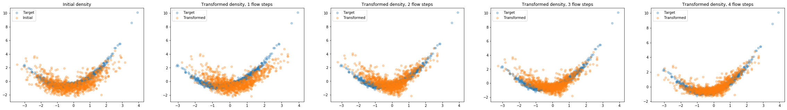
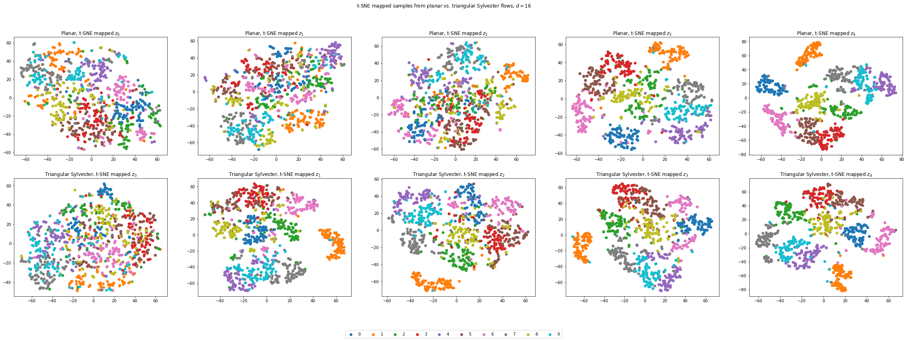

# normalizing-flows

Implementations of normalizing flows for variational inference using Python (3.6+) and Tensorflow (2.0+).

## Installation

    pip install git+https://github.com/bgroenks96/normalizing-flows
    
## Getting started

Take a look at the [intro notebook](normalizing-flows-intro.ipynb) for a gentle introduction to normalizing flows.

This library currently implements the following flows:

- Planar/radial flows [(Rezende and Mohamed, 2015)](https://arxiv.org/pdf/1505.05770.pdf)

- Triangular Sylvester flows [(Van den Berg et al, 2018)](https://arxiv.org/pdf/1803.05649.pdf)

- Glow [(Kingma et al, 2018)](https://papers.nips.cc/paper/8224-glow-generative-flow-with-invertible-1x1-convolutions.pdf)

- AlignFlow1 [(Grover et al, 2019)](https://arxiv.org/pdf/1905.12892.pdf)

1 *Implemented via [JointFlowLVM](normalizing_flows/models/joint_flvm.py); the flow architecture from the paper is not currently supported. However, Glow can (and possibly should) be used instead.*

## API overview

The `normalizing_flows` package currently provides two interfaces for building flow-based models:

1) Marginal inference ([FlowLVM](normalizing_flows/models/flvm.py), [JointFlowLVM](normalizing_flows/models/joint_flvm.py))

2) Variational autoencoder ([GatedConvVAE](normalizing_flows/models/vae.py))

Marginal inference models directly optimize the log-evidence $\log p(x)$ via the inverse transform of the flow. Note that this requires the flow to support bidirectional (forward + inverse) evaluation. The only flow architecture in this package which supports this (currently) is [Glow](normalizing_flows/flows/glow/glow_flow.py).

VAE inference minimizes the evidence lower bound (ELBO) and thus requires only forward evaluations, $z \rightarrow z'$ (i.e. the inverse need not be tractable). For VAE inference, Planar, Radial, and Triangular Sylvester flows are all supported via `FlowLayer` (see [the intro notebook](normalizing-flows-intro.ipynb) for an example). In theory, Glow could also be used in a VAE, but this has not been tested and is not currently supported by `FlowLayer`, which assumes the latent space to be dense and non-spatial.

### Exmaple: Planar vs Sylvester flows

*t-SNE mapped latent space across 4 flow steps*

## Future development

Please note that this package was developed for the purposes of the author's own research. As such, it might not be as fully featured or rounded out as other libraries. However, contributions and discussions about new features and flow implementations is both welcome and encouraged!

Additional types flows under consideration for future versions:

- Orthogonal/Householder Sylvester flows

- Inverse Autoregressive Flows (Kingma et al, 2016)

- Neural Autoregressive Flows (Huang et al, 2018)

Currently, this library has no published documentation outside of docstrings in the code. This may change in the future.

Please feel free to create an issue if anything isn't clear or more documentation is needed on specific APIs.

## License and use

This library is free and open source software under the MIT license.